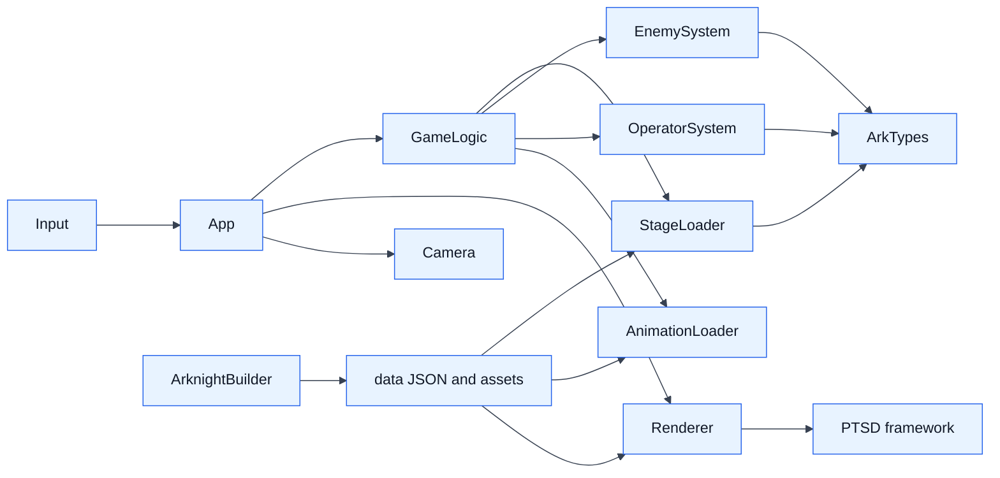
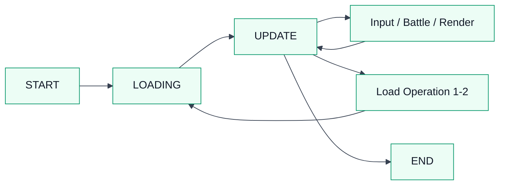

# 2026 OOPL Final Report

## 組別資訊

組別：T41  
組員：113820028 張浤奕  
復刻遊戲：明日方舟

## 專案簡介

### 遊戲簡介

本專案復刻《明日方舟》的核心塔防玩法。玩家需要在格子地圖上部署幹員，依照地形限制選擇地面或高台位置，消耗 DP 防守敵人波次，阻止敵人抵達目標點。

### 組別分工

| 組員 | 負責內容 |
|------|----------|
| 113820028 張浤奕 | 所有工作 |

## 遊戲介紹

### 遊戲規則

1. 玩家初始擁有10點部屬費用，遊戲進行時部屬費用會逐步回復，最高為 99。
2. 地面幹員只能部署在地面位，高台幹員只能部署在高台位，部分格子無法部屬幹員。
4. 從下方幹員列拖曳角色到格子上，再拖曳選擇攻擊方向即可完成布署。
5. 幹員會依照自身攻擊範圍、攻速、技能與目標選取邏輯攻擊敵人。
6. 敵人會從侵入點進場，當敵人抵達保護目標時減少耐久度，耐久度歸零即失敗。
7. 擊敗所有波次敵人後任務成功，完成第一關後會自動進入第二關。
8. 幹員撤退或死亡後會進入再部署冷卻。

操作方式：

| 操作 | 功能 |
|------|------|
| 滑鼠左鍵 | 點擊 UI、拖曳幹員、確認部署方向、點擊幹員技能 |
| 滑鼠右鍵 | 取消部署流程，或撤退已部署幹員 |
| `R` | 重新開始關卡 |
| `Z` | 切換作弊/debug 模式，戰鬥速度與幹員傷害提高 |
| `ESC` | 離開遊戲 |
| `1X` / `2X` 按鈕 | 切換遊戲速度 |
| 暫停按鈕 | 暫停或繼續遊戲 |

本專案實作的幹員：

| 幹員 | 類型 | 部署位置 | 特色 |
|------|------|----------|------|
| 風笛 | 先鋒 | 地面 | 高攻速與擊殺回費，技能可充能並強化下一次攻擊 |
| 桃金娘 | 先鋒 | 地面 | 可手動開技能回復 DP，技能期間阻擋數為 0，並提供先鋒回血效果 |
| 克洛絲 | 狙擊 | 高台 | 遠程攻擊，高台部署，技能為自動二連射 |

### 遊戲畫面

| 畫面 | 說明 |
|------|------|
|  | `Operation 1-1` 關卡背景 |
|  | `Operation 1-2` 關卡背景 |
|  | `Operation 1-1` 關卡載入畫面 |
|  | `Operation 1-1` 關卡完成畫面 |

## 程式設計

### 程式架構

本專案以 `App` 作為遊戲主流程控制器，透過狀態機切換 `START`、`LOADING`、`UPDATE` 與 `END`。實際功能再拆分到多個模組：`StageLoader` 負責讀取 JSON 關卡與資料，`GameLogic` 負責遊戲流程與波次，`EnemySystem` 與 `OperatorSystem` 負責戰鬥邏輯，`Renderer` 負責畫面繪製，`AnimationLoader` 負責整理動畫資源。另有獨立 CLI 工具 `ArknightBuilder` 用來建立、驗證、模擬與校準關卡。

遊戲流程如下：

主要資料流：

1. 關卡、幹員、敵人、波次與圖片路徑都放在 `data/`。
2. `StageLoader` 使用 `nlohmann::json` 解析關卡，轉成 `StageData`、`Route`、`WavePlan`、`EnemyTemplate` 等 C++ 結構。
3. `App::ResetDemo()` 初始化部屬費用、耐久度、波次、敵人、幹員與動畫狀態。
4. `UpdateGame()` 依照時間推進部屬費用、敵人生成、敵人移動、幹員攻擊與勝敗判斷。
5. `AppRenderer::DrawScene()` 依照遊戲狀態繪製背景、敵人、幹員、部署預覽與結算畫面。

### 程式技術

本專案使用的主要技術如下：

| 技術 | 用途 |
|------|------|
| C++17 | 主要開發語言，使用 `std::vector`、`std::map`、`std::optional`、`std::shared_ptr`、`std::filesystem` 等標準工具 |
| OOP 設計 | 以 `App`、`AppRenderer`、資料 struct 與不同 system 檔案拆分責任 |
| PTSD framework | 提供視窗、圖片、動畫、輸入、時間與渲染基礎 |
| SDL2 / OpenGL / ImGui | 透過 PTSD 間接使用，負責底層視窗、繪圖與 UI |
| nlohmann/json | 解析關卡、敵人、幹員與波次資料 |
| FFmpeg  | 產生翻轉動畫與動畫快取，降低素材處理成本 |
| CLI 工具 | `ArknightBuilder` 可建立、修改、驗證、模擬與校準關卡 |

重要模組說明：

| 模組 | 檔案 | 功能 |
|------|------|------|
| 主程式生命週期 | `src/App.cpp` | 處理 Start、Loading、Update、End 與輸入流程 |
| 遊戲流程 | `src/Ark/GameLogic.cpp` | 初始化關卡、波次、部屬費用/耐久度、勝敗與關卡轉換 |
| 敵人系統 | `src/Ark/EnemySystem.cpp` | 敵人生成、路線移動、阻擋、攻擊與死亡動畫 |
| 幹員系統 | `src/Ark/OperatorSystem.cpp` | 部署判定、攻擊目標、技能、SP、再部署冷卻 |
| 關卡載入 | `src/Ark/StageLoader.cpp` | 解析 JSON、載入 tile、route、enemy、wave、board art |
| 動畫載入 | `src/Ark/AnimationLoader.cpp` | 掃描幹員與敵人動畫資料夾並分類 clip |
| 渲染 | `src/Ark/Renderer/*.cpp` | 繪製背景、格線、角色、敵人、HUD、部署範圍與結算畫面 |
| 關卡工具 | `tools/ark_builder/src/*.cpp` | CLI 關卡建立、繪製、驗證、模擬與校準 |

### 使用到 AI/AI Agent 的部分 (沒有用到者，不需要寫這篇)

本專案在報告整理階段使用 AI Agent 輔助：

## 結語

### 問題與解決方法

| 問題 | 解決方法 |
|------|----------|
| 關卡圖片與邏輯格子不容易對齊 | 設計 `board_art` 資料結構，並實作 `ArknightBuilder calibrate`，用視覺化方式校準每個格子的四個角 |
| 動畫素材多，啟動與首次播放成本高 | 採用 lazy loading，並加入記憶體與磁碟動畫快取，也提供 `ArknightPreload` 預載工具 |
| Windows 中文路徑與建置容易出錯 | 提供 `build_win.bat`，並在 MSVC 使用 `/utf-8` |
| 部署流程需要同時處理拖曳、合法格、方向與攻擊範圍 | 將部署拆成「拖曳選格」與「方向選擇」兩階段，並用預覽格標示攻擊範圍 |
| 敵人與幹員動畫狀態容易互相干擾 | 將動畫 clip 與 active instance 分開管理，依照 idle、move、attack、skill、die 狀態切換 |
| 敵人波次與路線手動測試成本高 | 在 `ArknightBuilder` 加入快速測試功能，可先檢查 JSON 與時間軸再進遊戲 |
| 記憶體與資源管理 | 使用 `std::shared_ptr` 管理圖片/動畫，Reset、死亡與撤退時清理 active instance，避免重複載入與殘留引用 |

### 自評

| 項次 | 項目 | 完成 |
|------|------|------|
| 1 | 完成明日方舟核心塔防流程，包含部署、敵人波次、戰鬥、勝敗與兩個關卡 | V |
| 2 | 完成專案權限改為 public | V |
| 3 | 具有 debug mode 的功能 | V |
| 4 | 解決專案上所有 Memory Leak 的問題 | V |
| 5 | 報告中沒有任何錯字，以及沒有任何一項遺漏 | V |
| 6 | 報告至少保持基本的美感，人類可讀 | V |

### 心得

這次專題最大的挑戰不是單一功能，而是把許多系統串成一個可以玩的完整流程。明日方舟看起來是格子塔防，但實作後才發現它同時包含地圖校準、部署規則、角色方向、攻擊範圍、技能、敵人路線、動畫狀態、HUD 與資料格式。每個系統單獨做都不算太困難，但只要其中一個資料沒有對齊，就會影響整體遊戲體驗。

我在這個專案中學到最多的是模組化與資料驅動的重要性。把關卡、敵人、幹員與波次放進 JSON 後，調整內容不必一直改 C++ 程式；另外製作 `ArknightBuilder` 也讓關卡調整從手動改檔案變得更可控。最後完成兩個可銜接的關卡時，能看到資料、邏輯與畫面一起運作，這是這份專題最有成就感的地方。

### 貢獻比例

| 組員 | 貢獻比例 | 說明 |
|------|----------|------|
| 113820028 張浤奕 | 100% | 個人完成遊戲程式、素材整合、關卡工具、文件與測試 |
